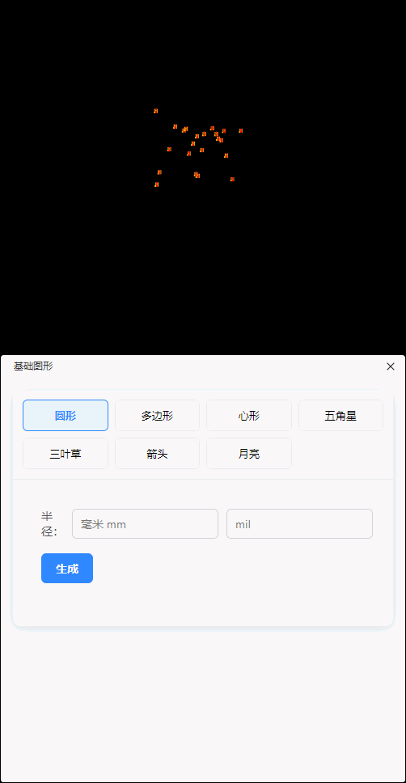
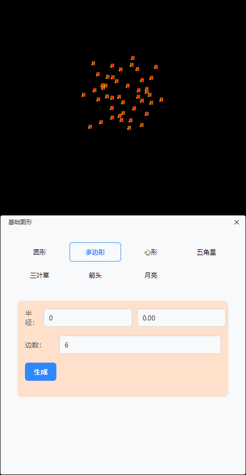
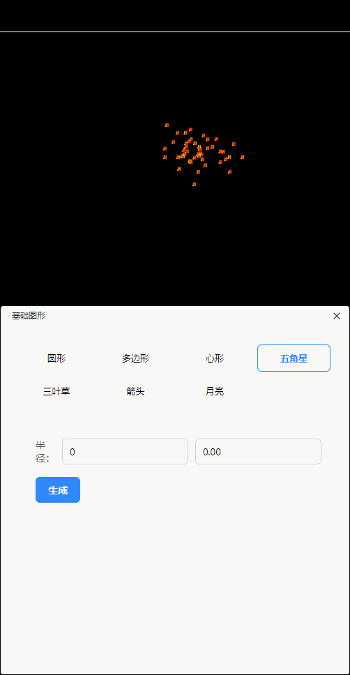
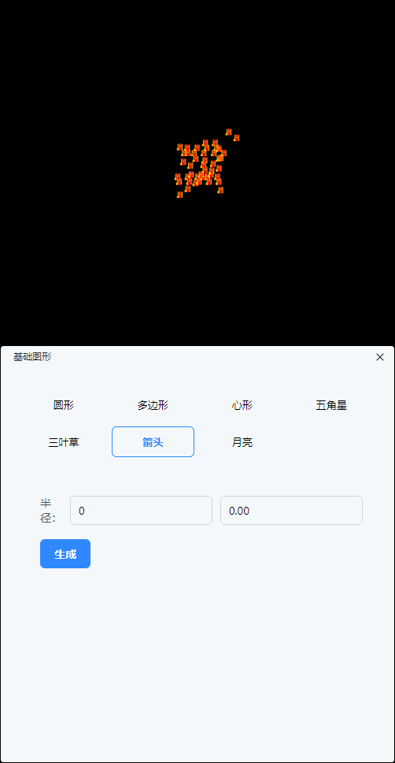
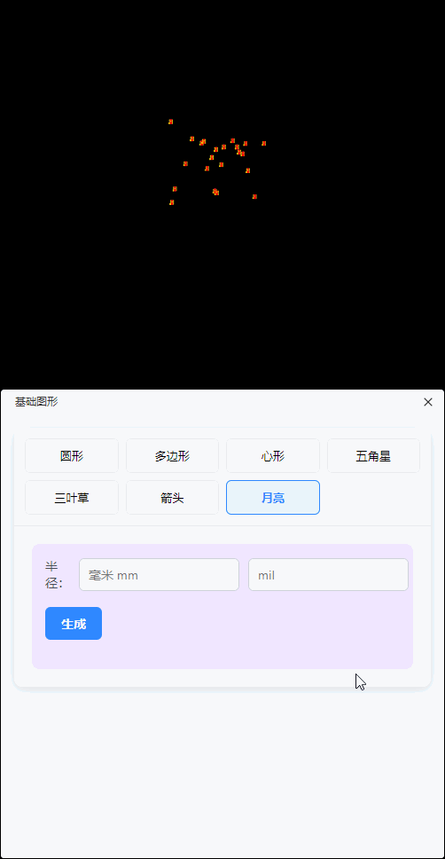

## Automatic_shape_arrangement
✨这是一个立创EDA的插件，它能帮助你快速把PCB元件排版好形状。

## 使用方法
✨圆形排版：

✨多边形排版：

✨心形排版：

✨五角星排版：

✨三叶草排版：

✨箭头排版：

✨月亮排版：

## 开源许可
本插件工具使用 [Apache License 2.0](https://choosealicense.com/licenses/apache-2.0/) 开源许可协议。
